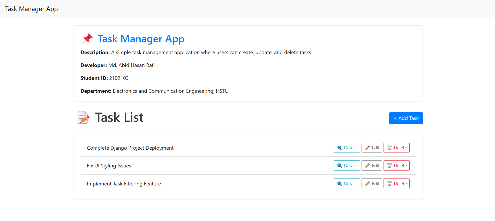

# Task Manager App



## Overview
The **Task Manager App** is a simple yet efficient web-based application that allows users to create, update, and delete tasks effortlessly. Designed for productivity, this app helps users manage their daily tasks in an organized manner.

## Features
- Create new tasks with titles, descriptions, and deadlines.
- Edit existing tasks to update their details.
- Mark tasks as complete or pending.
- Delete tasks that are no longer needed.
- User-friendly interface built with **Django** and **Bootstrap**.

## Technologies Used
- **Django** (Python framework for backend development)
- **Bootstrap** (CSS framework for responsive design)
- **SQLite** (Default Django database for storing tasks)

## Installation

To set up and run the application locally, follow these steps:

1. Clone the repository:
   ```sh
   git clone https://github.com/AbidHasanRafi/task-manager-app.git
   ```
2. Navigate to the project directory:
   ```sh
   cd task-manager-app
   ```
3. Create a virtual environment:
   ```sh
   python -m venv venv
   ```
4. Activate the virtual environment:
   - On Windows:
     ```sh
     venv\Scripts\activate
     ```
   - On macOS/Linux:
     ```sh
     source venv/bin/activate
     ```
5. Install dependencies:
   ```sh
   pip install -r requirements.txt
   ```
6. Run migrations:
   ```sh
   python manage.py migrate
   ```
7. Start the development server:
   ```sh
   python manage.py runserver
   ```
8. Open your browser and go to:
   ```
   http://127.0.0.1:8000/
   ```

## Author
Developed by **Abid Hasan Rafi**

- **GitHub:** [AbidHasanRafi](https://github.com/AbidHasanRafi)
- **Portfolio:** [abid-hasan-rafi.web.app](https://abid-hasan-rafi.web.app/)

## License
This project is open-source and available under the **MIT License**.

